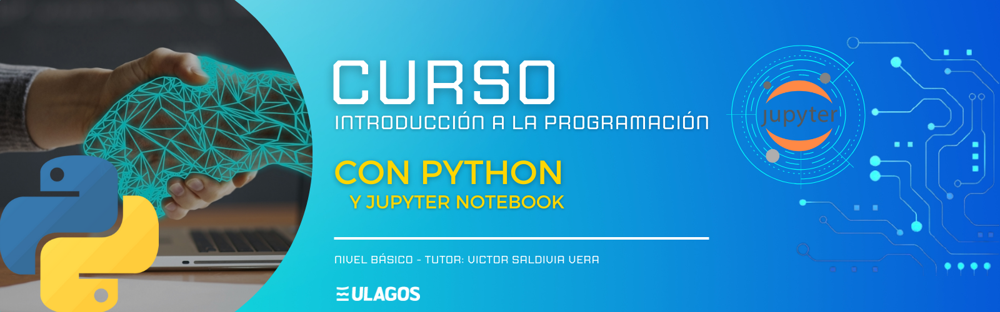

# Repositorio Nivel Básico Python

   
   
   

## Descripción del Proyecto

Este repositorio contiene información para trabajar con Python Básico desde cero. 
Incluye uso de variables, estructuras de datos, condicionales y ciclos. 
Todo esto para adentrarse poco a poco en el mundo de la programación con Python.

También se incluirá el uso de condicionales y ciclos para la lógica de diferentes
algoritmos y los distintos tipos de datos.

Se irá actualizando el contenido de este repositorio durante el primer semestre de este año 2023.

## Enlaces de Interés

- Web oficial de Python [(Instalacion Python)][python]
- Visual Studio Code [(Editor de Texto)][vscode]

[python]: https://www.python.org/downloads/
[vscode]: https://code.visualstudio.com/download

